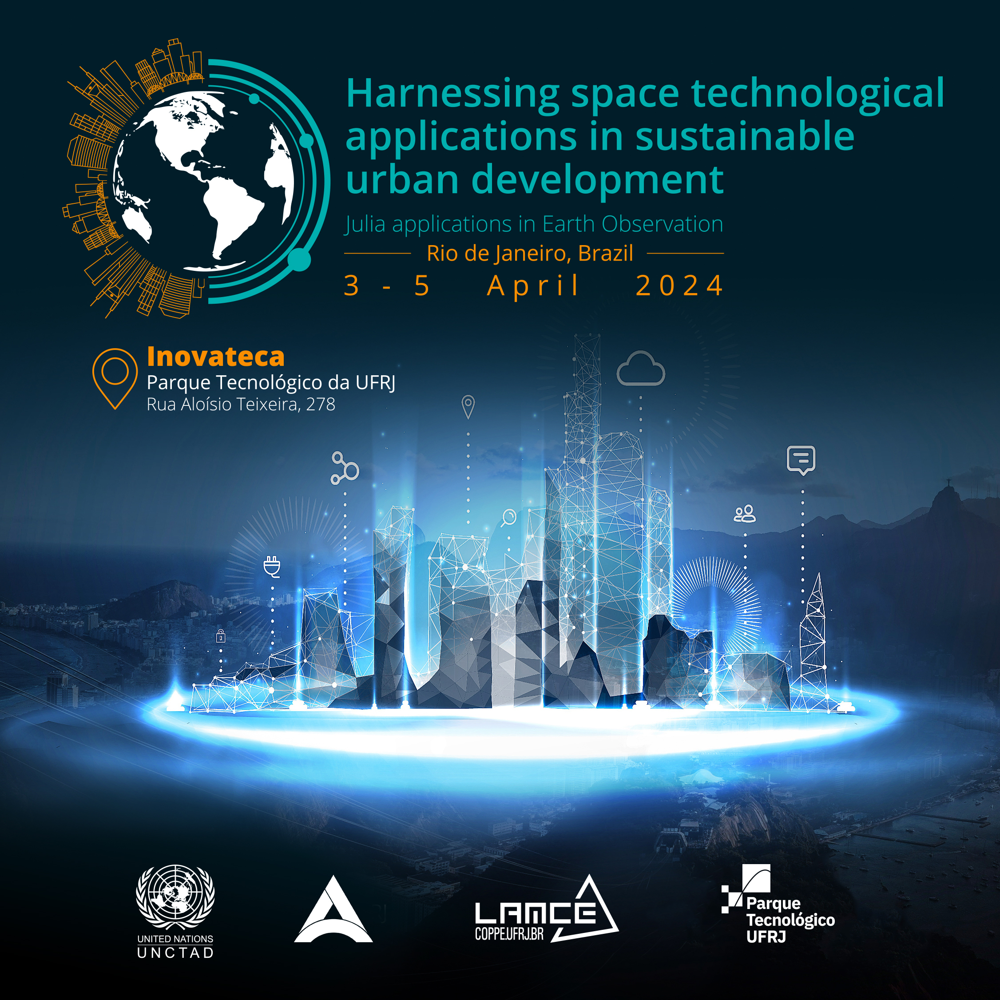

# Introduction to Julia
This is an introduction to the Julia programming language for the participants of the [Workshop on harnessing space technological applications in sustainable urban development](https://unctad.org/project/harnessing-space-technological-applications-sustainable-urban-development), a joint initiative of the Atlantic International Research Centre and the United Nations Conference on Trade and Development.

The workshops target Brazil and South Africa:

* 03 - 05 April 2024, Rio de Janeiro, Brazil [[Webpage]](https://unctad.org/meeting/workshop-harnessing-space-technological-applications-sdgs)
* 06 - 08 August 2024, Pretoria, South Africa [[Webpage]](https://unctad.org/meeting/workshop-harnessing-space-technological-applications-sdgs-0)

